# Mermaid.js Architecture Diagrams

This document contains all system architecture diagrams for AICluster, rendered via [Mermaid.js](https://mermaid.js.org/). Paste any diagram block into a Mermaid-compatible viewer (GitHub markdown, [Mermaid Live Editor](https://mermaid.live/), or documentation tool).

---

## Table of Contents

| # | Diagram | Description |
|---|---------|-------------|
| a | Overall System Architecture | Master server with Workers, Desktop apps, Web frontend, CLI |
| b | Master Internal Components | FastAPI, WebSocket, SQLite, Workflow, AI, Agents, Plugins |
| c | Worker State Machine | Full lifecycle from STARTING to EXIT |
| d | Worker Registration Sequence | Worker → Master → ID storage |
| e | Heartbeat Sequence | Worker → Master → WebSocket broadcast |
| f | Job Execution Flow | Queue → Poll → Execute → Report |
| g | AI Runtime Architecture | Prompt → Router → Provider → Response |
| h | Multi-Agent Flow | Request → Plan → Execute → Review → Merge |
| i | Workflow DAG Execution | Create → Plan → Dispatch → Execute |
| j | Build Pipeline | Source → PyInstaller/Tauri → Release |
| k | Database Schema Relationships | All master tables with relationships |
| l | Startup Sequence | Installer → Master → Workers → UI → Ready |

---

## a. Overall System Architecture

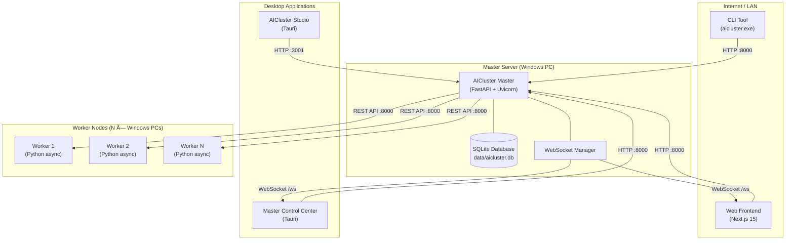

---

## b. Master Internal Components

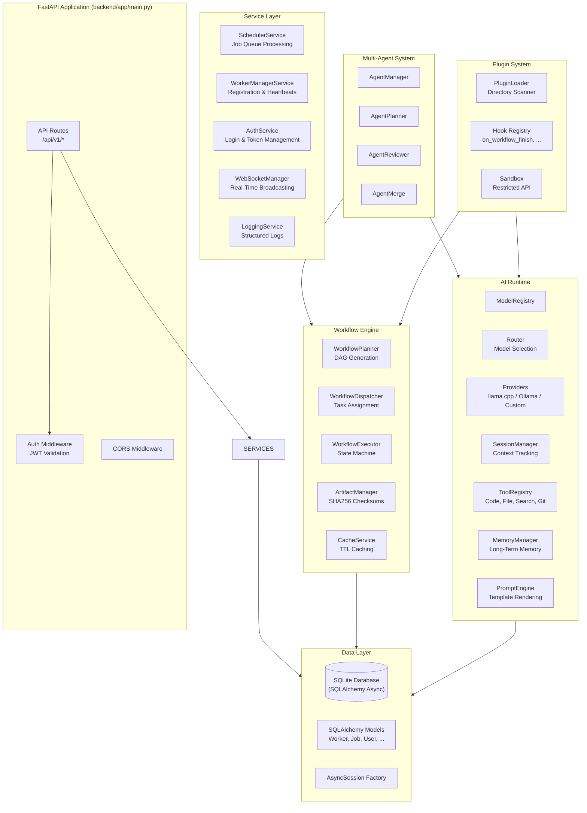

---

## c. Worker State Machine

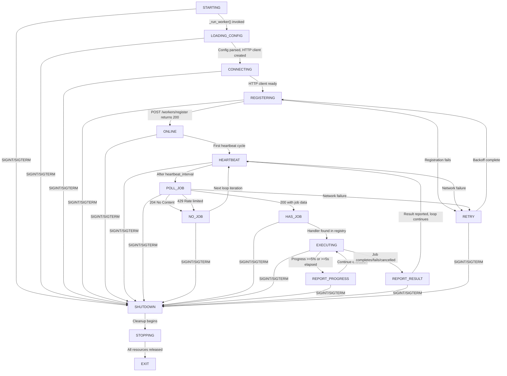

---

## d. Worker Registration Sequence

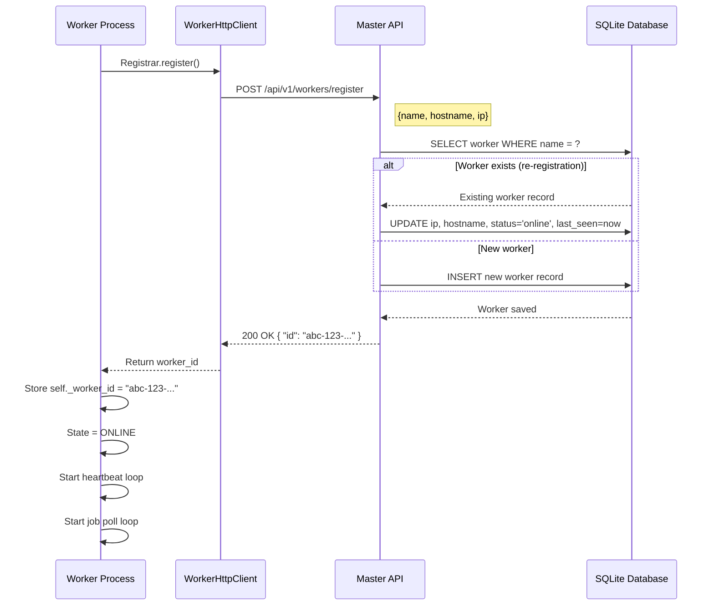

---

## e. Heartbeat Sequence

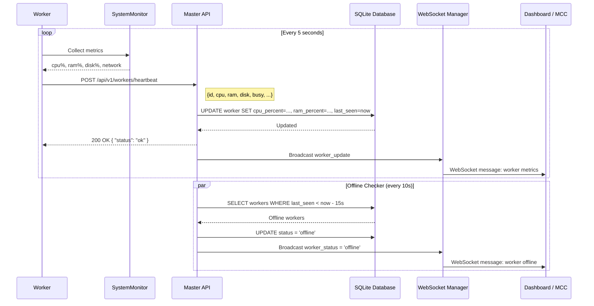

---

## f. Job Execution Flow

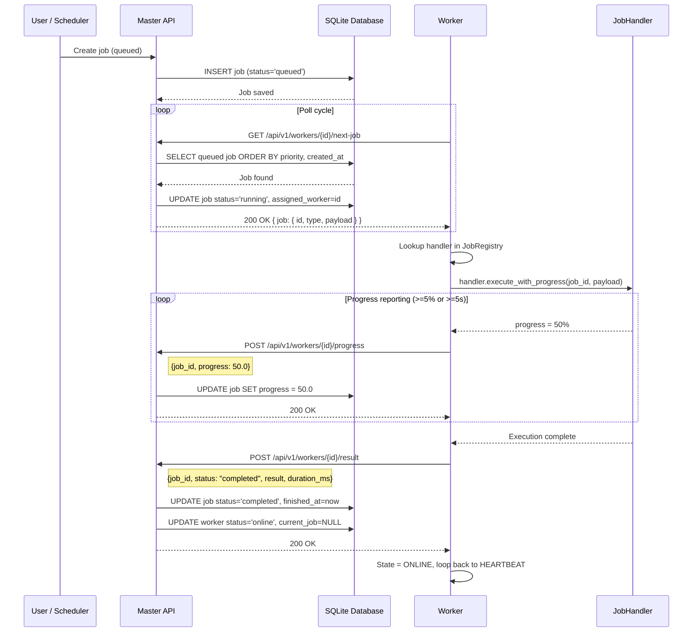

---

## g. AI Runtime Architecture

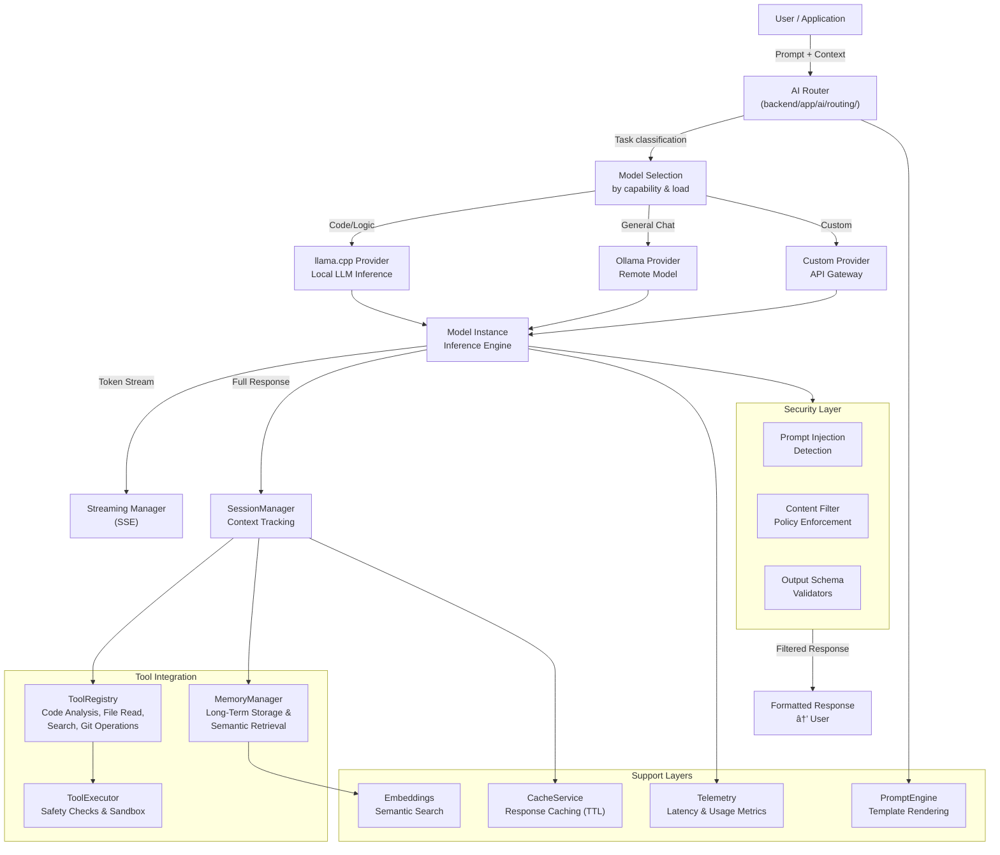

---

## h. Multi-Agent Flow

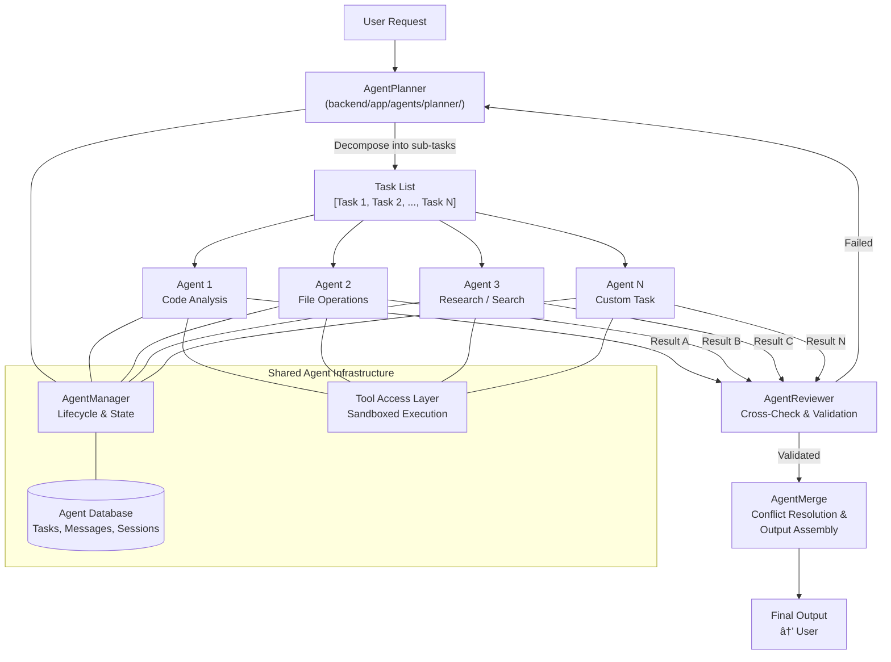

---

## i. Workflow DAG Execution

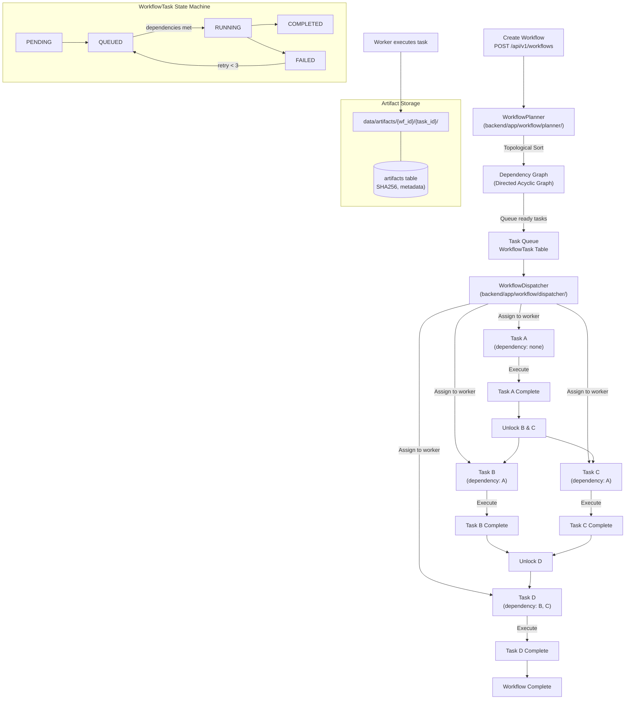

---

## j. Build Pipeline

```mermaid
flowchart TD
    SOURCE["Source Code\nbackend/ worker/ studio/ frontend/ cli/"] --> BUILD["Build Script\npython -m build.build"]

    subgraph Builder["Build Process"]
        PYINSTALLER["PyInstaller\nPython → .exe"]
        TAURI["Tauri v2\nRust → .exe"]
        FE_BUILD["Next.js 15\nnpm run build → static/"]
    end

    BUILD --> PYINSTALLER
    BUILD --> TAURI
    BUILD --> FE_BUILD

    PYINSTALLER -->|"Master + Worker +\nCLI + Control Centers"| RELEASE_DIR["release/\nversioned output directory"]
    TAURI -->|"Studio +\nControl Centers"| RELEASE_DIR
    FE_BUILD -->|"Static files"| RELEASE_DIR

    RELEASE_DIR --> PE_GATE["PE Gate\n(pefile analysis)"]
    PE_GATE -->|"Verify PE headers\n& Authenticode"| SIG["Code Signing\n(sign.py)"]

    SIG -->|"Timestamp + Sign"| PKG["Package\nInno Setup 6 Installer"]

    PKG --> VERIFY["Verification\n(setup_validator.py)"]
    VERIFY -->|"SHA256 checksums\nInstall test\nContent audit"| FINAL_VERIFIED["Verified Release"]

    FINAL_VERIFIED --> RELEASE_TAG["Git Tag\nv2.0.0"]
    RELEASE_TAG --> GITHUB["GitHub Release\nAssets: .exe, .sha256, Release Notes"]

    subgraph Checks["Quality Gates"]
        LINT["ruff lint\n0 errors"]
        TYPE["mypy typecheck\n0 errors"]
        TEST["pytest\nall pass"]
    end

    SOURCE --> Checks
    Checks --> BUILD
```

---

## k. Database Schema Relationships

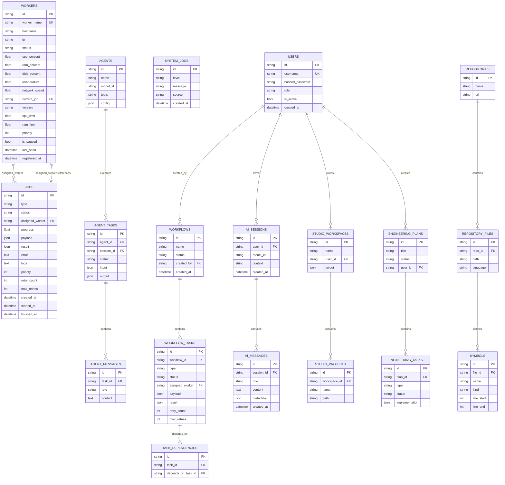

---

## l. Startup Sequence

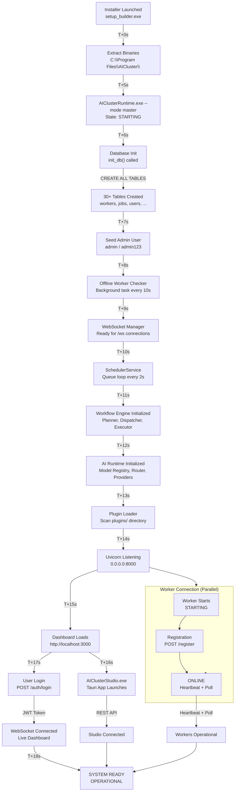
